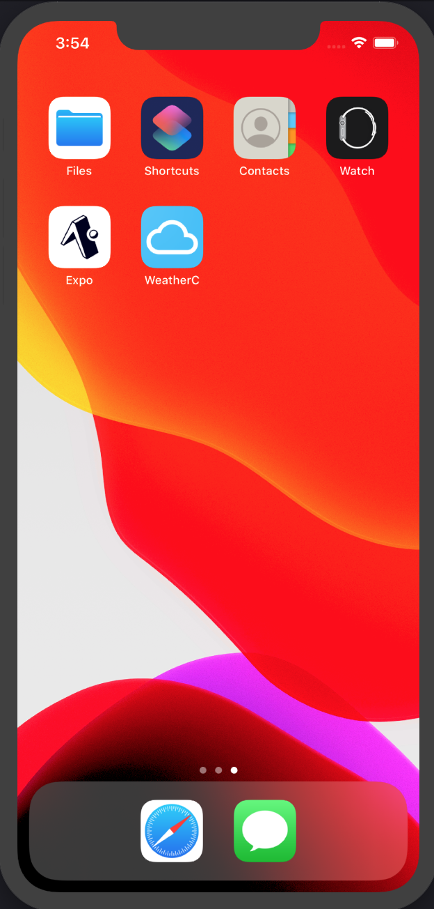
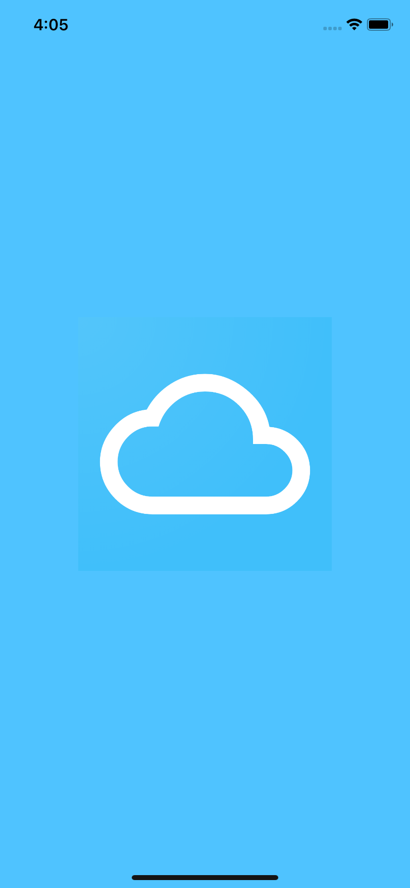
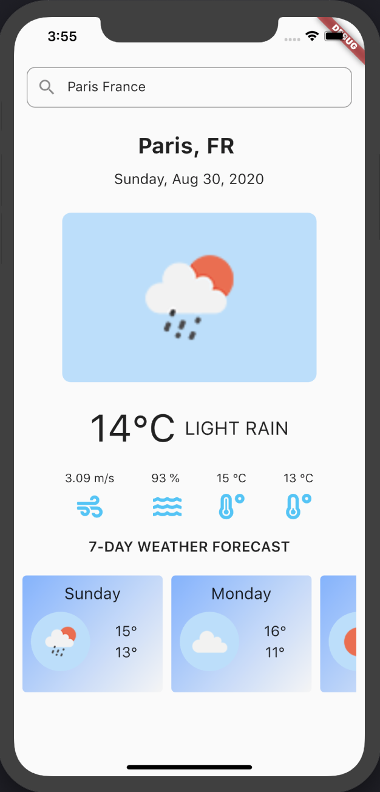
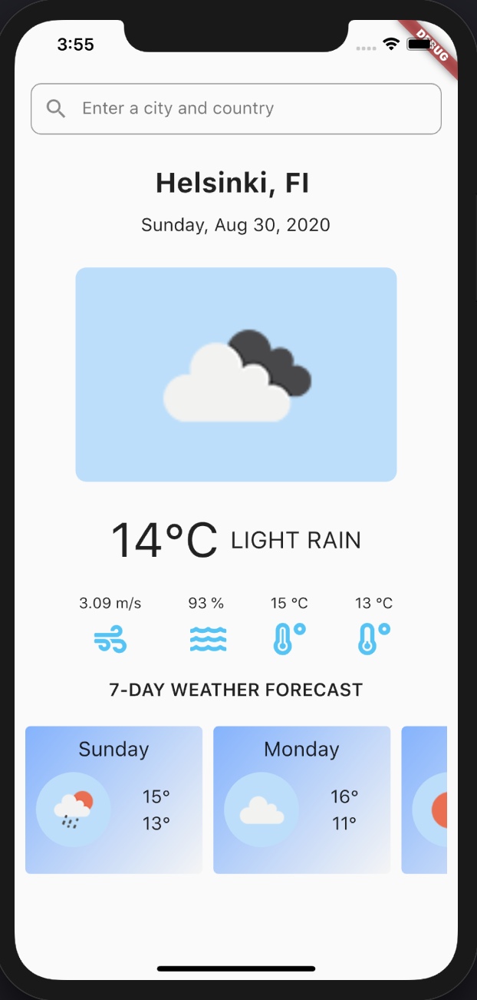

# Weather Forecast Mobile App

A new Flutter project.

## Getting Started

This app will fetcch the weather information of cities you enter. Default city is Helsinki.

App Icon in drawers

Launcher Image

In app images

